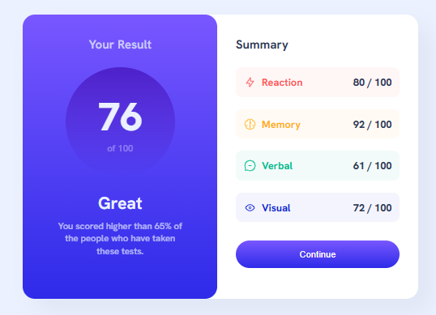

# Frontend Mentor - Results Summary Component Solution

This is my solution to the **Results Summary Component challenge** on Frontend Mentor.
The goal of this project was to build a results summary UI component using HTML and CSS, focusing on layout structure, styling, and visual balance.

---

## 📸 Screenshot

---

## 🔗 Links

* 💻 **Solution URL:** https://github.com/Haco31/results-summary-component.git
* 🌐 **Live Site URL:** https://haco31.github.io/results-summary-component/

---

## 🛠 Built With

* Semantic **HTML5**
* **CSS3**
* CSS Box Model
* Basic responsive design

---

## 🎯 What I Practiced

Through this project I practiced:

* Structuring a **multi-section component**
* Styling layouts with **CSS**
* Using colors and contrast to represent data
* Managing spacing and alignment
* Building visually balanced UI components

---

## 💡 What I Learned

This project helped me strengthen my understanding of:

* Creating structured layouts with multiple sections
* Using color systems to represent categories (Reaction, Memory, etc.)
* Improving UI design with spacing and alignment
* Writing cleaner and more organized CSS

---

## 📚 Challenge Source

This challenge was provided by **Frontend Mentor**, a platform that helps developers improve their coding skills through real-world projects.

https://www.frontendmentor.io

---

## 👨‍💻 Author

* GitHub – https://github.com/Haco31
* Frontend Mentor – https://www.frontendmentor.io/profile/Haco31

---

# Versión en Español

## 📖 Descripción

Este proyecto es mi solución al reto **Results Summary Component** de Frontend Mentor.

El objetivo fue construir un componente de resumen de resultados utilizando **HTML y CSS**, enfocándome en la estructura del layout, el uso de colores y la presentación de la información.

---

## 🚀 Tecnologías utilizadas

* HTML5
* CSS3

---

## 🎯 Qué practiqué

* Estructura semántica en HTML
* Creación de componentes con múltiples secciones
* Uso de colores para representar categorías
* Manejo del **Box Model**
* Espaciado y alineación en CSS

---

## 💡 Aprendizajes

Durante este proyecto reforcé conceptos importantes como:

* Cómo estructurar componentes más complejos
* Cómo usar el color para mejorar la comprensión visual
* Cómo organizar mejor el CSS
* Cómo mejorar la presentación de datos en la interfaz

---

⭐ If you like this project, feel free to give it a star!
